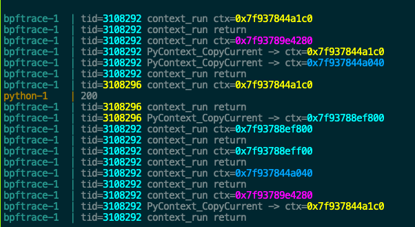

## Running

```console
docker compose up --remove-orphans  --build
```

## Sample output

Sample output of running [print_calls.bt](./print_calls.bt) with [plain.py](./plain.py) as an example workload. `plain.py` uses `asyncio.to_thread()` to run some blocking IO in a thread pool.



<details>

<summary>Raw output</summary>

```
bpftrace-1  | tid=3108292 context_run ctx=0x7f937844a1c0
bpftrace-1  | tid=3108292 context_run return
bpftrace-1  | tid=3108292 context_run ctx=0x7f93789e4280
bpftrace-1  | tid=3108292 PyContext_CopyCurrent -> ctx=0x7f937844a1c0
bpftrace-1  | tid=3108292 PyContext_CopyCurrent -> ctx=0x7f937844a040
bpftrace-1  | tid=3108292 context_run return
bpftrace-1  | tid=3108296 context_run ctx=0x7f937844a1c0
python-1    | 200
bpftrace-1  | tid=3108296 context_run return
bpftrace-1  | tid=3108296 PyContext_CopyCurrent -> ctx=0x7f93788ef800
bpftrace-1  | tid=3108292 context_run ctx=0x7f93788ef800
bpftrace-1  | tid=3108292 context_run return
bpftrace-1  | tid=3108292 context_run ctx=0x7f93788eff00
bpftrace-1  | tid=3108292 context_run return
bpftrace-1  | tid=3108292 context_run ctx=0x7f937844a040
bpftrace-1  | tid=3108292 context_run return
bpftrace-1  | tid=3108292 context_run ctx=0x7f93789e4280
bpftrace-1  | tid=3108292 PyContext_CopyCurrent -> ctx=0x7f937844a1c0
bpftrace-1  | tid=3108292 context_run return
```

</details>

In this example, `3108292` is the main event loop thread and `3108296` is a thread pool worker
thread, which runs work from `asyncio.to_thread()`. The `ctx=...` values are pointers for
[`contextvars.Context`](https://docs.python.org/3/library/contextvars.html#contextvars.Context)
objects.

In the example,
- the main thread is initially running `0x7f937844a1c0`
- it switches to `0x7f93789e4280`. From here it creates two new child contexts
  * `0x7f937844a1c0`[^1]
  * `0x7f937844a040`
- the worker thread runs `0x7f937844a1c0` which presumably makes the HTTP request
- ...

The `context_run` calls correspond to `contextvars.run()`, used internally by
asyncio to manage the execution context of tasks, and `PyContext_CopyCurrent()` calls which
correspond to creating "child" contexts.

---

[^1]: Note that Python's memory allocator might reuse
addresses for `Context` objects over time (it keeps a freelist), but the sequence of copy
operations followed by their use in the worker thread should still make sense.
